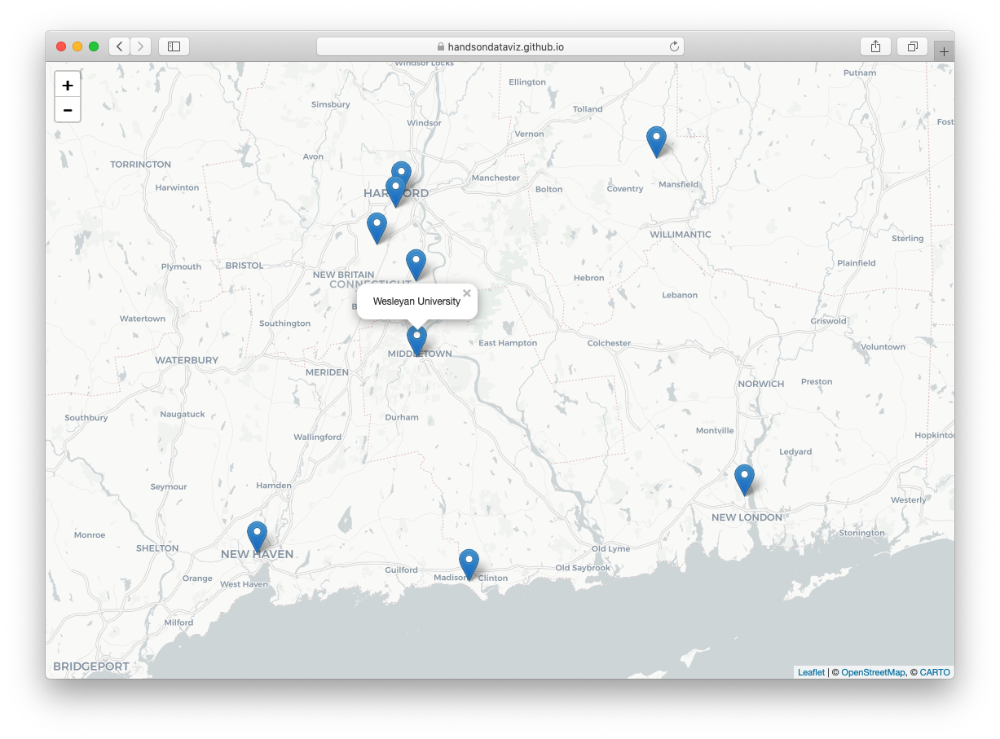

# leaflet-map-csv
Build a simple Leaflet map with point markers from a CSV file.



## Demo
https://handsondataviz.github.io/leaflet-map-csv/

Sample data of select universities and colleges around CT by HandsOnDataViz.

## Make your own

1. Press **Use this template** button to create a copy of this repository in your own GitHub account.
2. Put your point data data inside `data.csv`. The only relevant columns that will be read by the template
are `Latitude`, `Longitude`, and `Title` (displayed in a popup). Sample data:
```
Title,Latitude,Longitude
Trinity College,41.745167,-72.69263
Wesleyan University,41.55709,-72.65691
```

For more information on customization, see [Leaflet documentation](https://leafletjs.com/).

## HandsOnDataViz Tutorial
https://handsondataviz.org/leaflet-maps-with-csv.html

## See other Leaflet templates
* [Simple Leaflet map](https://github.com/HandsOnDataViz/leaflet-map-simple)
* [Leaflet map with open data APIs](https://github.com/HandsOnDataViz/leaflet-maps-open-data-apis)
* [Leaflet map with data from Socrata](https://github.com/HandsOnDataViz/leaflet-socrata)
* [Leaflet polygon map with tabs](https://github.com/HandsOnDataViz/leaflet-map-polygon-tabs)
* [Leaflet heatmap](https://github.com/HandsOnDataViz/leaflet-heatmap)
* [Searcheable Map Template](https://github.com/HandsOnDataViz/searchable-map-template-csv)
* [Leaflet Maps with Google Sheets](https://github.com/HandsOnDataViz/leaflet-maps-with-google-sheets)
* [Leaflet Storymaps with Google Sheets](https://github.com/HandsOnDataViz/leaflet-storymaps-with-google-sheets)
